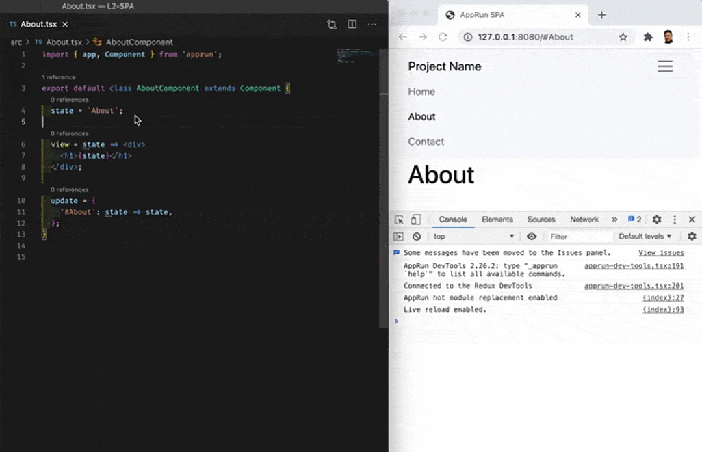

# apprun-dev-server

This is a static web server for developing JavaScript/TypeScript using ES modules following the concept of [Unbundled Development](https://www.snowpack.dev/concepts/how-snowpack-works).

* It serves the ES Modules from unpkg.com.
* Based on [live-server](https://www.npmjs.com/package/live-server), so it reloads the page automatically
* Also, it detects [AppRun](https://github.com/yysun/apprun) and can replace the module/Component while keeping the application _state_.


# How to Use

You export Component as the default module export.

```javascript
import { app, Component } from 'apprun';

export default class AboutComponent extends Component {
  state = 'About';
  view = state => <div>
    <h1>{state}</h1>
  </div>;
  update = {
    '#About': state => state,
  };
}
```

Then, you use the Component in the main file.

```javascript
import About from './About';

new About().start('my-app');
```

Then, you use a module-typed script tag in HTML.

```html
<!DOCTYPE html>
<html lang="en">
<head>
  <meta charset="utf-8">
  <title>AppRun SPA</title>
</head>
<body>
  <script type="module" src="/dist/main.js"></script>
</body>
</html>
```

Turn on the compiler, TypeScript or Babel in watch mode. And then, start the apprun-dev-server.

```
npx apprun-dev-server
```

apprun-dev-server checks and modifies *.js file if they have global modules. In the console, if you see the file names that have some dots '......' in front, they are the files modified.

You can download an example app to give it a try.

```
npx degit yysun/apprun-esm-server my-app
```

# Configuration

Create a apprun-dev-server.config.js in your project:

```javascript
module.exports = {
  port: 8181, // Set the server port. Defaults to 8080.
  host: "0.0.0.0", // Set the address to bind to. Defaults to 0.0.0.0 or process.env.IP.
  root: "public", // Set root directory that's being served. Defaults to cwd.
  open: false, // When false, it won't load your browser by default.
  ignore: '', // comma-separated string for paths to ignore
  file: "index.html", // When set, serve this file (server root relative) for every 404 (useful for single-page applications)
  wait: 1000, // Waits for all changes, before reloading. Defaults to 0 sec.
  mount: [], // Mount a directory to a route.
  logLevel: 2, //
}
```
# Future Plan

Don't want apprun-dev-server to invoke compilers/loaders. It is perfectly fine to use the TypeScript compiler in watch mode. apprun-dev-server is a webserver to serve modules. Nothing else.

Webpack is still needed and recommended for building production code for now.

The node-modules folder size is a problem. apprun-dev-server can run from npx. It does not need to live in the node-modules. However, it does not get away from npm install and huge node-modules folder, because we still need referenced packages, ESLint, Jest... Good luck with future npm improvement.

Based on the opinions above, I will keep apprun-dev-server simple. KISS!

Give it a try and send pull requests.

(C) Copyright 2020, Yiyi Sun