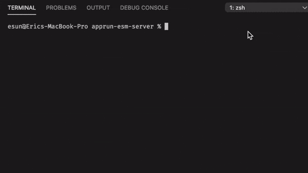

# esm-server

This is a static web server for developing JavaScript/TypeScript using ES modules. It is based on [live-server](https://www.npmjs.com/package/live-server) and also can serve ES Modules from unpkg.com.

# How to Use

You code using modules.

```javascript
import app from 'apprun';
import Home from './Home';
import About from './About/index';
import Contact from './Contact';
import Layout from './Layout';

app.render(document.body, <Layout />);

const element = 'my-app';
About(element, { route: '#About' });
Contact(element, { route: '#Contact' });
new Home().start(element);
```

You use modules in HTML.

```html
<!DOCTYPE html>
<html lang="en">
<head>
  <meta charset="utf-8">
  <title>AppRun SPA</title>
</head>
<body>
  <script type="module" src="/dist/main.js"></script>
</body>
</html>
```

If you are using a compiler TypeScript or Babel, run them in watch mode. Then, start the esm-server using npx.

```
npx esm-server
```


esm-server checks and modifies *.js file if they have global modules. In the console, if you see the file names that have some dots '......' in front, they are the files modified.

You can download an example app to give it a try to feel how fast the [Unbundled Development](https://www.snowpack.dev/concepts/how-snowpack-works) can be.

```
npx degit yysun/apprun-esm-server my-app
```

# Configuration

Create a esm-server.config.js in your project:

```javascript
module.exports = {
  port: 8181, // Set the server port. Defaults to 8080.
  host: "0.0.0.0", // Set the address to bind to. Defaults to 0.0.0.0 or process.env.IP.
  root: "public", // Set root directory that's being served. Defaults to cwd.
  open: false, // When false, it won't load your browser by default.
  ignore: '', // comma-separated string for paths to ignore
  file: "index.html", // When set, serve this file (server root relative) for every 404 (useful for single-page applications)
  wait: 1000, // Waits for all changes, before reloading. Defaults to 0 sec.
  mount: [], // Mount a directory to a route.
  logLevel: 2, //
}
```

# Future Plan

Don't want esm-server to invoke compilers/loaders. It is perfectly fine to use the TypeScript compiler in watch mode. esm-server is a webserver to serve modules. Nothing else.

Webpack is still needed and recommended for building production code for now.

The node-modules folder size is a problem. esm-server can run from npx. It does not need to live in the node-modules. However, it does not get away from npm install and huge node-modules folder, because we still need referenced packages, ESLint, Jest... Good luck with future npm improvement.

Based on the opinions above, I will keep esm-server simple. KISS!

Give it a try and send pull requests.

(C) Copyright 2020, Yiyi Sun